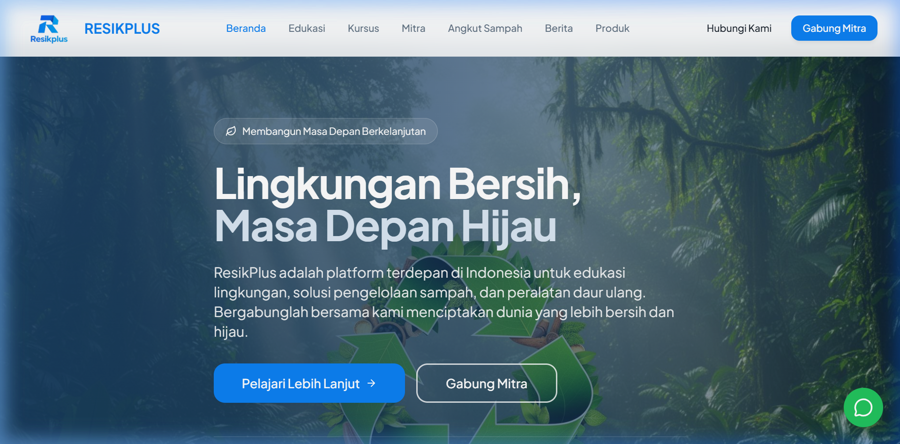

# Resikplus Backend

Resikplus Backend is a Django-based application designed to manage various aspects of the Resikplus platform. It provides APIs for user management, courses, products, partners, articles, waste pickups, and dashboards.

---

## Table of Contents
- [Features](#features)
- [Installation](#installation)
- [API Overview](#api-overview)
- [Project Structure](#project-structure)
- [Image Previews](#image-previews)
- [Technologies Used](#technologies-used)

---

## Features
- User authentication and management
- Course management
- Product catalog
- Partner management
- Waste pickup scheduling
- Dashboard for analytics
- RESTful APIs for all functionalities

---

## Installation

1. Clone the repository:
   ```bash
   git clone <repository-url>
   ```

2. Navigate to the backend directory:
   ```bash
   cd resikplus/backend
   ```

3. Create and activate a virtual environment:
   ```bash
   python -m venv venv
   ./venv/Scripts/activate
   ```

4. Install dependencies:
   ```bash
   pip install -r requirements.txt
   ```

5. Run migrations:
   ```bash
   python manage.py migrate
   ```

6. Start the development server:
   ```bash
   python manage.py runserver
   ```

---

## API Overview

### Authentication
- **POST** `/api/token/` - Obtain JWT token
- **POST** `/api/token/refresh/` - Refresh JWT token

### Accounts
- **GET** `/accounts/` - List all users
- **POST** `/accounts/register/` - Register a new user

### Courses
- **GET** `/courses/` - List all courses
- **POST** `/courses/` - Create a new course

### Products
- **GET** `/products/` - List all products
- **POST** `/products/` - Add a new product

### Waste Pickups
- **GET** `/waste-pickups/` - List all waste pickups
- **POST** `/waste-pickups/` - Schedule a new waste pickup

---

## Project Structure

```
resikplus/
├── apps/
│   ├── accounts/       # User management
│   ├── courses/        # Course management
│   ├── products/       # Product catalog
│   ├── waste_pickups/  # Waste pickup scheduling
│   └── ...
├── core/               # Core settings and configurations
├── docs/               # Documentation and images
├── media/              # Uploaded media files
└── manage.py           # Django management script
```

---

## Image Previews

### Landing Page


---

## Technologies Used
- **Django**: Backend framework
- **Django REST Framework**: API development
- **SQLite**: Database
- **JWT**: Authentication
- **Python**: Programming language

---

## License
This project is licensed under the MIT License. See the LICENSE file for details.